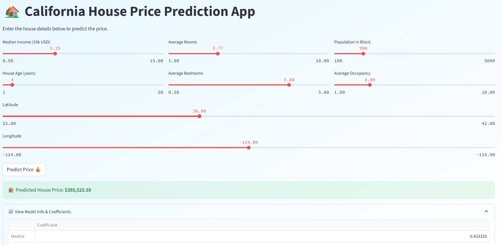

# 🏡 California House Price Prediction using Streamlit

This project uses the **California Housing dataset** to predict median house prices using **Linear Regression**. Built with an intuitive and attractive UI using **Streamlit**, the app allows users to input various housing parameters and see the predicted price instantly.

---
## 📸 Screenshots

### 🏠 Home Page


## 📊 Features

- Clean and user-friendly Streamlit interface
- Input sliders for features like income, room size, population, etc.
- Real-time prediction output using a trained Linear Regression model
- Option to deploy on **Streamlit Cloud** for public access

---

## 🛠 Tech Stack

| Tool          | Use                     |
|---------------|--------------------------|
| Python        | Core programming         |
| Pandas, NumPy | Data manipulation        |
| Scikit-learn  | Machine learning model   |
| Streamlit     | Web app framework        |
| Matplotlib    | Optional visualizations  |

---

## 🚀 How to Run Locally

1. **Clone the repository**
   ```bash
   git clone https://github.com/Suyoga28/House_price_prediction.git
   cd House_price_prediction
